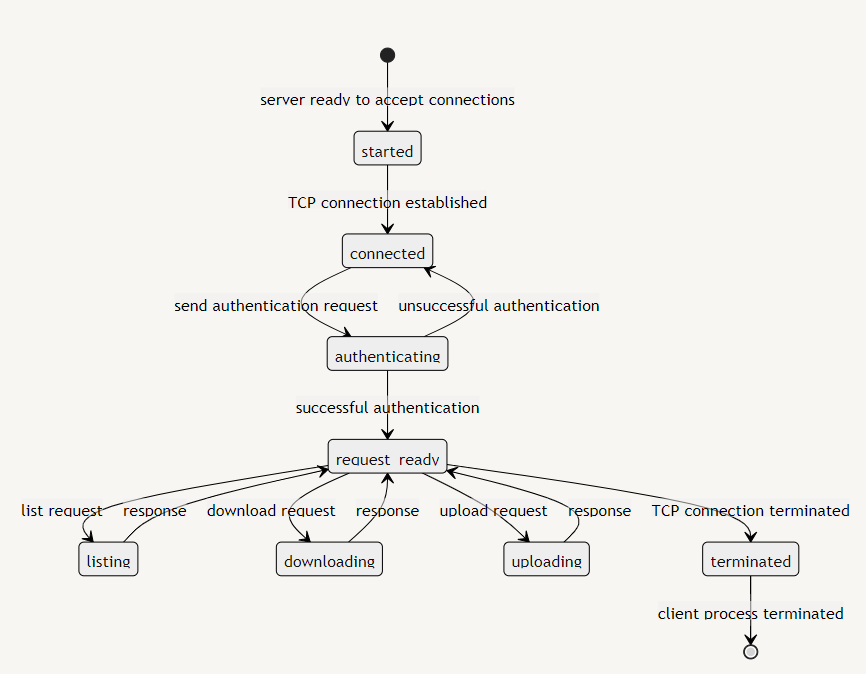
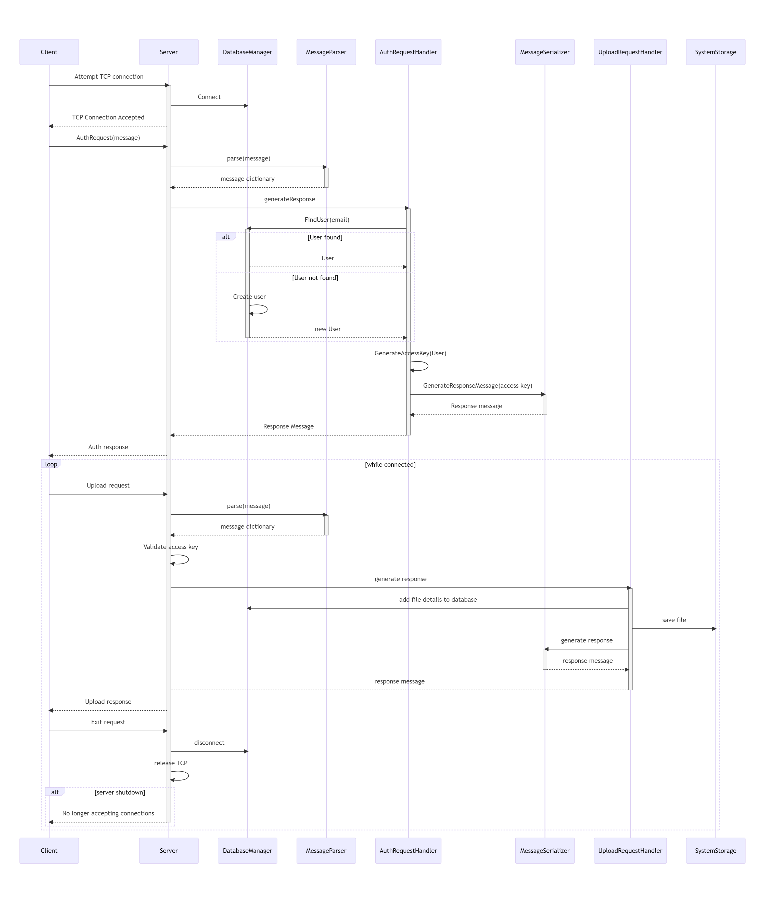
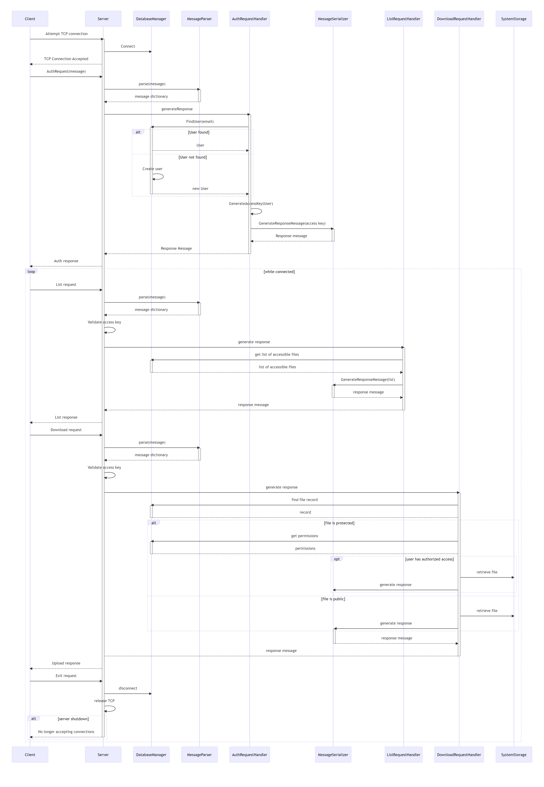

# Setting Up and Running a Pipenv Project

This README provides instructions for setting up and running a Python project using Pipenv, a tool for managing Python environments and dependencies.

## Prerequisites

Before you begin, ensure that you have the following installed on your system:

- Python (3.5 or later)
- Pipenv (if not installed, you can install it using `pip install pipenv`)

## Clone the Repository

Clone the project repository to your local machine using Git. Replace `<repository_url>` with the actual URL of your project repository.

```bash
git clone <repository_url>
```

## Navigate to the Project Directory

Change your working directory to the root folder of the project.

```bash
cd <project_directory>
```

## Create a Virtual Environment and Install Dependencies

Pipenv uses virtual environments to isolate project dependencies. To create a new virtual environment and install the project dependencies specified in the Pipfile, run the following command:

```bash
pipenv install
```

This will create a virtual environment for your project and install the necessary packages.

## .env File Configuration

In the root directory of your project, create a file named `.env`. This file should contain one key-value pair in the format `PORT=desired_port_number`. Replace `desired_port_number` with the port number you want your application to use. This environment variable can be used in your code to configure the application's port.

Example .env file:

```env
PORT=8080
```

## Activate the Virtual Environment

To activate the virtual environment, use the following command:

```bash
pipenv shell
```

You should now see your command prompt change to indicate that you are in the virtual environment.

## Running the Project

You can now run your Python project within the virtual environment. Typically, you would run your project using the command specified in your project's Pipfile.

For example, if your Pipfile specifies a `main.py` script as the entry point for your project, you can run it as follows:

```bash
python main.py
```

Make sure to refer to your project's documentation or Pipfile to determine the correct command for running your specific project.

## Deactivate the Virtual Environment

When you're done working on your project, you can deactivate the virtual environment by simply running:

```bash
exit
```

This will return you to your system's global Python environment.

## Managing Dependencies

To add or remove dependencies for your project, you can use the following Pipenv commands:

- To install a new package: 
  ```bash
  pipenv install <package_name>
  ```

- To uninstall a package:
  ```bash
  pipenv uninstall <package_name>
  ```

- To update all packages to their latest versions:
  ```bash
  pipenv update
  ```

- To generate a `Pipfile.lock` file with specific versions (for production):
  ```bash
  pipenv lock
  ```

- To generate a `requirements.txt` file (useful for deployment):
  ```bash
  pipenv lock -r
  ```

For more information on using Pipenv, please refer to the [official documentation](https://pipenv.pypa.io/en/latest/).

# Write-Up: Creating a Client-Server Application Implementing a Custom Application Layer Protocol

| Name | Student Number |
| --- | --- |
| Tiyani Mhlarhi | MHLTIY006 |
| Owethu Novuka | NVKOWE001 |
| Maesela Sekoele | SKLMAE001 |

# Introduction

A protocol can simply be described as a set of defined rules governing the interactions between two network nodes. The TCP/IP suite specifies 5 layers of protocols with different responsibilities. Every layer will have its own protocols that service the layer below it.

The scope of this assignment was to develop an application layer protocol whose primary usage will be in the transferring of files over a TCP connection, and to develop an application that uses this protocol to maintain a client-server file sharing system. This application would allow users to upload and download files from a shared server, with protection options available for users to add to their files. The feature specifications of this application are discussed below.

# Features

## Persistent/semi-persistent connections

The protocol enables persistent connections and reduces connection overhead. The initial TCP connection only occurs once, enabling faster access to application functions without re-connecting. Idle connections are discarded, freeing server resources and reducing traffic.

## Reliable data transfer

The protocol uses TCP for reliable data transfer and includes checksums to verify message integrity. The receiver hashes the received message and compares it to the checksum. If different, the message is discarded and the sender is notified of corruption, at which point it is up to the client application as to how it deals with that error, some clients may retransmit without user intervention, some may simply notify the user of the error.
This extra verification provides assurance of data integrity.

## Authentication

The application implements a combination of a username, password and access keys. The username and password are used to log into a session, and the access key which is generated for each user, is sent with each message to authenticate that message requests come from verified users. 

This assures that only verified users can have access to the shared database.

## File authorization

The app lets users choose who can see their files when uploaded. Files can be public (accessible to all) or protected (accessed only by selected users).

This gives users full control over using the server: sharing files as ‘open’ or ‘protected’.

## Simultaneous server access

The server runs multithreaded code, allowing for multiple users to access the server at the same time. This increases the usability of the app greatly; users do not have to wait for another user to finish their session before starting theirs. This improves the efficiency of the app.

## Assumptions

Assumes that applications implementing the protocol will take necessary security and privacy into consideration (especially due to how ‘English-like’ the protocol is). Applications that use this protocol would also ideally encrypt the messages before sending them out and implement a more intuitive and scalable file system which are features outside of the scope for this particular project.

## Limitations

Due to time constraints, the systems developed do have limitations both at implementation levels and at the protocol level.

### Implementation Limitations

1. Static access key
    
    The access key generated by the server is not secure and can be stolen by an unauthorized third party. The access key is also static in that the same user will always have the same access key. Such a limitation can be overcome by introducing session based access keys which would change every time a user connects to the server.
    
2. No ability to edit or change files
    
    Files that are uploaded to the server are on the server indefinitely, since there is no function to delete files of the server, nor is there a function to edit the details or content of an uploaded file. Such a limitation can be overcome by introducing message types that could carry changed content or a delete method which the server could then react accordingly.
    

### Protocol Limitations

The protocol was also designed with scalability and flexibility in mind allowing applications implementing it to extend it as they see fit. Through the inclusion of custom headers of variable lengths.

However this flexibility comes at the cost of a more difficult to implement protocol. Due to the lengths of messages being variable in length, applications implementing the protocol should account for these. As part of the protocol, a message size along with a file size (for when files are transferred) are included to aid in the implementation.

The protocol has also been designed in a human readable manner having units of information enclosed in clear delimiters. 

As a result of the variable lengths of messages and text delimiters, the implementation is made more complex and transfer speeds will vary greatly as more or less bytes will have to be sent from message to message.

# Protocol Specification

As mentioned prior, the protocol designed is for the application layer, the protocol makes use of TCP connections, and the protocol is designed for file transfers. The protocol also has to manage the protection of files should the user wish to grant certain users access to the file. 

## System states

The state machine diagram shows the general states that will exist in the client-server system. The system requires a form of handshaking in that a user must be authenticated before they can send requests to the server. If a user is not authenticated, the server will refuse to accept requests.



## Message Formats & Structure

There are two types of messages defined in the protocol:

1. Command messages → define the different stages of communication
2. Data transfer messages → used to carry data that is exchanged between parties
3. Response messages → used to provide feedback to the client applications

**Legend**

- Angular brackets *****<>***** represent values. e.g. <message size> becomes 16
- Square brackets *******[]*** represent optional fields
- ***CRLF*** represents the "Carriage Return" and "Line Feed" characters
- All else ********must******** be included

### Command messages

| byte size |  | Authentication Command Message |  |
| --- | --- | --- | --- |
| 64 B + 2 B |  | <checksum> | CRLF |
| 16 B + 2 B |  | <message size> | CRLF |
| 7 B + 2 B |  | {START} | CRLF |
| 2 B |  |  | CRLF |
| 16 B + 2 B |  | {{START METHOD}} | CRLF |
| - |  | AUTH <username> <password> | CRLF |
| - |  | {{END METHOD}} | CRLF |
| 2 B |  |  | CRLF |
| - |  | {END} | <file> |

| byte size |  | Exit Command Message |  |
| --- | --- | --- | --- |
| 64 B + 2 B |  | <checksum> | CRLF |
| 16 B + 2 B |  | <message size> | CRLF |
| 7 B + 2 B |  | {START} | CRLF |
| 2 B |  |  | CRLF |
| 16 B + 2 B |  | {{START METHOD}} | CRLF |
| - |  | EXIT <username> <password> | CRLF |
| - |  | {{END METHOD}} | CRLF |
| 2 B |  |  | CRLF |
| - |  | {END} | <file> |

### Data transfer message

| byte size |  |  |  |
| --- | --- | --- | --- |
| 64 B + 2 B |  | <checksum> | CRLF |
| 16 B + 2 B |  | <message size> | CRLF |
| 7 B + 2 B |  | {START} | CRLF |
| 2 B |  |  | CRLF |
| 16 B + 2 B |  | {{START METHOD}} | CRLF |
| - |  | DATA <method> <ip>:<port> [<file_name>] | CRLF |
| - |  | {{END METHOD}} | CRLF |
| 2 B |  |  | CRLF |
| 17 B + 2 B |  | {{START HEADERS}} | CRLF |
| - |  | USER:<username> | CRLF |
| 75 B + 2 B |  | ACCESS_KEY:<access_key> | CRLF |
|  |  | [AUTHORIZED:(<username>,...)] |  |
| - |  | [<header_name>:<header_value>] | CRLF |
| 15 B + 2 B |  | {{END HEADERS}} | CRLF |
| 2 B |  |  | CRLF |
| 14 B + 2 B |  | {{START FILE}} | CRLF |
| - |  | FILE_SIZE:<file_size> | CRLF |
| 12 B + 2 B |  | {{END FILE}} | CRLF |
| 2 B |  |  | CRLF |
| - |  | {END} | <file> |

### Response message

| byte size |  | Response message |  |
| --- | --- | --- | --- |
| 64 B + 2 B |  | <checksum> | CRLF |
| 16 B + 2 B |  | <message size> | CRLF |
| 7 B + 2 B |  | {START} | CRLF |
| 2 B |  |  | CRLF |
| 18 B + 2 B |  | {{START RESPONSE}} | CRLF |
| - |  | <status code> “<status message>” <content size OR access key> | CRLF |
| 16 B + 2 B |  | {{END RESPONSE}} | CRLF |
| 2 B |  |  | CRLF |
| - |  | {END} | <file> |

## System and Protocol Sequencing

******************************Auth→Upload→Exit Sequence******************************



****************************************************Auth→Download→Exit Sequence****************************************************


